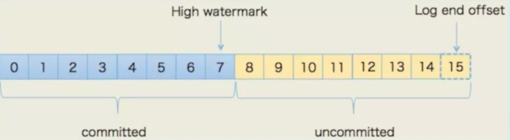

# 第一章 初识kafka

> 基于Scala语言开发的一个多分区、多副本并且基于zookeeper协调的分布式发布-订阅消息系统

**特性**

> 优势：可伸缩扩展、高容错和可靠性、吞吐量

- 高吞吐量、低延迟（每秒处理几十万条消息，延迟最多几毫秒）
- 高扩展性（集群分布式分区存储）
- 持久性、可靠性（消息持久化到磁盘）
- 容错性（多副本）
- 高并发（支持数千个客户端同时读写）

**应用场景**

- 日志收集（统一收集，再分发到 各中consumer，如Hadoop、elasticsearch）
- 消息系统（解耦生产者、消费者、缓存消息）
- 用户活动信息跟踪（分topic记录用户活动信息并分发）
- 流式处理

## 1.1 相关概念


**Topic**
	kafka划分数据的所属类

**Partition**
	topic的消息数据分割/分区 存储到多个节点，一个Partition由多个segment文件组成，一个segment文件包含多个消息数据。Partition内部是有序的，但是Partition之间不保证有序。严格有序则将Partition的数量设为1

**Replica of Partition**
	分区的备份，不会被消费者消费，只用于防止数据丢失；存在于Follower中，不会被直接消费
	**AR**：Assigned Replicas 分区中所有的副本

**Partition Offset**
	每一条消息数据都有一个当前Partition的64字节的offset值，指明了该条消息的距离Partition头的位置=消息的起始位置，是有序的保障
	**HW**：High-Watermark，一个特定的offset，消费者只能取该offset之前的消息

**Broker：Leader + Follower**
	kafka集群 = Brokers， Controller Broker选举产生 负责Brokers的状态管理
	一个Broker即是Kafka集群的一个实例/服务器节点（可能有多个服务器）；节点中有一个Leader，负责响应、路由请求、数据同步等管理功能；多个Follower，负责复制备份
	**ISR**：In-Sync-Replicas 所有与Leader保持一定同步程度的follower集合，新Leader候选集
	**OSR**：Out-Sync-Replicas  与Leader滞后一定同步程度的Follower集合，无法参加新Leader的选举
	**LEO**：Log-End-Offset，日志末端位移，记录副本底层日志中下一条新消息的位移值（即已保存的偏移量）
	

**Zookeeper**
	集中配置管理服务，负责维护和协调Brokers，监控Broker状态并同步到生成者、消费者；负责选举产生Controller

## 1.2 安装

```shell
# 拉取镜像
docker pull wurstmeister/zookeeper
docker pull wurstmeister/kafka

# 启动zookeeper
docker run -d --name zookeeper -p 2181:2181 -t wurstmeister/zookeeper

# 启动kafka
docker run  -d --name kafka -p 9092:9092 -e KAFKA_BROKER_ID=0 -e KAFKA_ZOOKEEPER_CONNECT=192.168.1.100:2181 -e KAFKA_ADVERTISED_LISTENERS=PLAINTEXT://192.168.1.100:9092 -e KAFKA_LISTENERS=PLAINTEXT://0.0.0.0:9092 -t wurstmeister/kafka

# docker-compose
version: '3'
services:
  zookeeper:
    image: wurstmeister/zookeeper   ## 镜像
    ports:
      - "2181:2181"                 ## 对外暴露的端口号
  kafka:
    image: wurstmeister/kafka       ## 镜像
    volumes:
        - /etc/localtime:/etc/localtime ## 挂载位置（kafka镜像和宿主机器之间时间保持一直）
    ports:
      - "9092:9092"
    depends_on:
    	- zookeeper
    environment:
      KAFKA_ADVERTISED_HOST_NAME: 182.92.217.111   ## 修改:宿主机IP， localhost
      KAFKA_ZOOKEEPER_CONNECT: zookeeper:2181       ## 卡夫卡运行是基于zookeeper的
      KAFKA_ADVERTISED_PORT: 9092
      KAFKA_LOG_RETENTION_HOURS: 120
      KAFKA_MESSAGE_MAX_BYTES: 10000000
      KAFKA_REPLICA_FETCH_MAX_BYTES: 10000000
      KAFKA_GROUP_MAX_SESSION_TIMEOUT_MS: 60000
      KAFKA_NUM_PARTITIONS: 3
      KAFKA_DELETE_RETENTION_MS: 1000
# bin
cd /opt/kafka_2.13-2.7.0/bin

# 启动producer
kafka-console-producer.sh --broker-list localhsot:9092 --topic mykafka
# 启动consumer
kafka-console-consumer.sh --bootstrap-server localhost:9092 --topic mykafka --from-beginning
# 通过 zookeeper 查看topic
bin/kafka-topics.sh --describe --zookeeper zookeeper:2181 --topic mykafka
```

# 第二章 生产者

> send -> 序列器 -> 分区器 -> Broker -> 返回消息元数据（topic、partition、offset）

```python
#########################################
# prodicer对象：bootdtrap_servers、retries、value_serializer
# send方法：topic、message(key, value) => 返回消息元数据
1. 同步阻塞式获取结果
future = producer.send(**data)
try:
  record_metadata = future.get(timeout=10)
except KafkaError:
  log.exception()
  pass
2. 异步回调处理
producer.send(**data).add_callback(on_success_func).add_errback(on_failed_func)
###########################################

from kafka import KafkaProducer
from kafka.errors import KafkaError

producer = KafkaProducer(bootstrap_servers=['host:port'])

# Asynchronous by default, 分区 和 键
future = producer.send('my-topic', b'raw_bytes')

# Block for 'synchronous' sends
try:
    record_metadata = future.get(timeout=10)
except KafkaError:
    # Decide what to do if produce request failed...
    log.exception()
    pass

# Successful result returns assigned partition and offset
print(record_metadata.topic)
print(record_metadata.partition)
print(record_metadata.offset)

# produce keyed messages to enable hashed partitioning
producer.send('my-topic', key=b'foo', value=b'bar')

# encode objects via msgpack
producer = KafkaProducer(value_serializer=msgpack.dumps)
producer.send('msgpack-topic', {'key': 'value'})

# produce json messages
producer = KafkaProducer(value_serializer=lambda m: json.dumps(m).encode('ascii'))
producer.send('json-topic', {'key': 'value'})

# produce asynchronously
for _ in range(100):
    producer.send('my-topic', b'msg')

def on_send_success(record_metadata):
    print(record_metadata.topic)
    print(record_metadata.partition)
    print(record_metadata.offset)

def on_send_error(excp):
    log.error('I am an errback', exc_info=excp)
    # handle exception

# produce asynchronously with callbacks
producer.send('my-topic', b'raw_bytes').add_callback(on_send_success).add_errback(on_send_error)

# block until all async messages are sent
producer.flush()

# configure multiple retries
producer = KafkaProducer(retries=5)
```

# 第三章消费者

```python
#################################################
# 消费组  = 多个消费组消费同一主题时，会获得不同分区的消息
# consumer对象：bootstrap_servers、topic、group_id、value_serializer
1.订阅
consumer.subscribe(pattern="^awesome.*")
2. 获取消费者对列
for message in consumer.poll(timeout_ms=100):
  message对象
# message对象的属性：topic, partition, offset, key, value
# 消费者更新offset位移 - commit提交
auto_offset_reset=earliest｜latest
enable_auto_commit=False
# 自动提交每auto_commit_interval_ms=5s提交一次，提交失败丢失或重复消费 consumer.close()也会触发
# 手动提交方式
1. 同步 -> 阻塞
  consumer.commit()  # 阻塞式提交当前批次的最新偏移量
2. 异步 -> 不重试，丢失
def _on_send_response(*args, **kwargs):
      """
      提交偏移量涉及回调函数
      :param args: args[0] -> {TopicPartition:OffsetAndMetadata}  args[1] -> True/Exception
      :param kwargs:
      :return:
      """
      if isinstance(args[1], Exception):
          print('偏移量提交异常. {}'.format(args[1]))
      else:
          print('偏移量提交成功')

consumer.commit_async(callback=on_commit_success)

3. 同步 + 异步; 最后使用同步提交解决异步的丢失问题；更严格的需要额外存储ID 和 状态的，乐观锁拒绝掉旧位点数据
try:
  start_time = time.time()
  while True:
      data = consumer.poll(timeout_ms=100)
      # 逻辑处理
      try:
        # 每一批次异步提交
          consumer.commit_async(callback=on_commit_success)
      except Exception as e:
          pass
except Exception：
    pass
finally:
    try:
      # 同步提交弥补
      consumer.commit()
except Exception:
    pass
#################################################
# message.topic, message.partition, message.offset, message.key, message.value
from kafka import KafkaConsumer

# To consume latest messages and auto-commit offsets
consumer = KafkaConsumer('my-topic',
                         group_id='my-group',
                         bootstrap_servers=['localhost:9092'])
# consumer.subscribe(topics=('test','test0'))

for message in consumer:
    # message value and key are raw bytes -- decode if necessary!
    # e.g., for unicode: `message.value.decode('utf-8')`
    print ("%s:%d:%d: key=%s value=%s" % (message.topic, message.partition,
                                          message.offset, message.key,
                                          message.value))

# consume earliest available messages, don't commit offsets
KafkaConsumer(auto_offset_reset='earliest', enable_auto_commit=False)
# earliest移到最早的可用消息，latest最新的消息，默认为latest

# consume json messages
KafkaConsumer(value_deserializer=lambda m: json.loads(m.decode('ascii')))

# consume msgpack
KafkaConsumer(value_deserializer=msgpack.unpackb)

# StopIteration if no message after 1sec
KafkaConsumer(consumer_timeout_ms=1000)

# Subscribe to a regex topic pattern
consumer = KafkaConsumer()
consumer.subscribe(pattern='^awesome.*')

# Use multiple consumers in parallel w/ 0.9 kafka brokers
# typically you would run each on a different server / process / CPU
consumer1 = KafkaConsumer('my-topic',
                          group_id='my-group',
                          bootstrap_servers='my.server.com')
consumer2 = KafkaConsumer('my-topic',
                          group_id='my-group',
                          bootstrap_servers='my.server.com')
```


# 第四章 主题

**shell创建**

```shell
# shell脚本创建
kafka-topics.sh --create --zookeeper zookeeper:2181 --replication-factor 1 --partitions 1 --topic topicname
```

**Client API创建**

```python
# kafka admin client api

# AdminClient
from kafka.admin import KafkaAdminClient, NewTopic
admin_client=KafkaAdminClient(
    bootstrap_servers="localhost:9092",
    client_id='test'
)

topic_list=[]
topic_list.append(NewTopic(name="example_topic", num_partitions=1, replication_factor=1))
admin_client.create_topics(new_topics=topic_list, validate_only=False)

# Client
from confluent_kafka.admin import AdminClient, NewTopic


admin_client=AdminClient({
   "bootstrap.servers":"localhost:9092"
})

topic_list=[]
topic_list.append(NewTopic("example_topic", 1, 1))
admin_client.create_topics(topic_list)

```

# 第五章 分区

> 分区的增加提供kafka的吞吐量，分区数过错导致延迟及

**Leader选举**
	副本机制，每一个Leader有多个Follower副本；zookeeper针对每一个topic维护一个ISR（In-Sync-Replica），如果ISR为空，则只能选举OSR中的副本

**分区分配策略**

- RangeAssign： 分区数/消费者数 = N，分区数%消费者数 = M，前M个每个分配N+1个分区，剩余的每个分配N个
- RoundRobinAssign：轮询分配
- StickyAssign：1. 分配尽可能均匀；2. 分配变动最少

# 第六章 kafka存储

> Partition 文件夹， 大小相等的segment文件，但是消息数量不一定相等

**巨额吞吐量**

- 顺序写入：文件追加写入消息，不允许修改已经写入的消息
- 大量使用页缓存：一次性保存页面大小的文件块到内存中
- 零拷贝技术：一次性将磁盘文件的数据复制到页缓存，避免重复复制操作