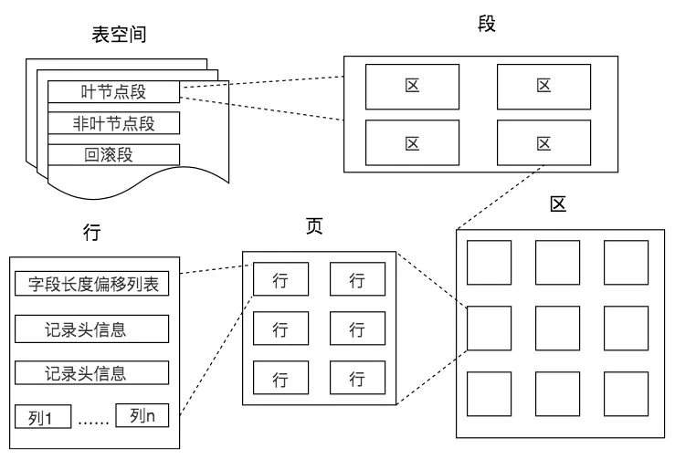
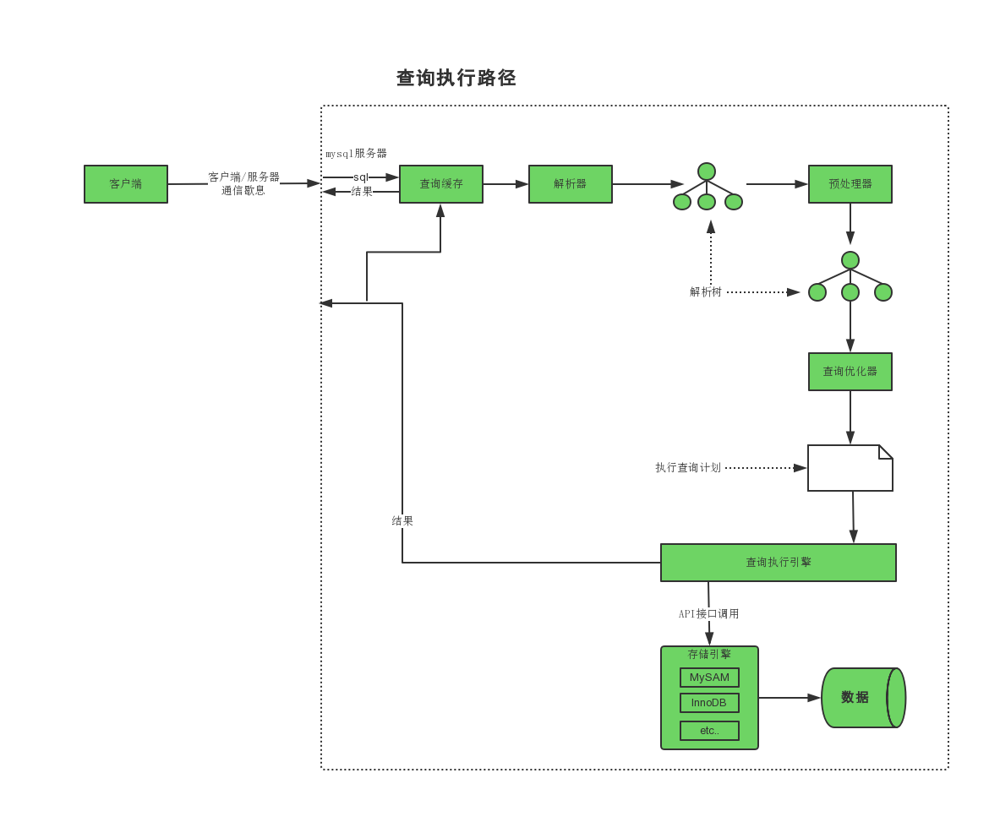

关系型数据库的三大范式 和 BC范式
> 1. 第一范式 1NF：表中所有属性都不能再分，都应该是**原子值**  -  原子
>
> 2. 第二范式 2NF：每一个**非主属性**都要**完全依赖**于任何一个**候选码**  -  完全依赖
>
> 3. 第三范式 3NF：表中不存在传递依赖，即表中每一列都要与主键[^**直接相关**]  -  直接依赖
>
> 4. BCNF：修正/扩充的第三范式，只能依赖于主键
>
>    ​	eg.
>
>    ​	student_id  |  project  |  professor
>
>    ​	one professor teaches only one subject, not accomplished inverse
>
>    ​	For each subject, a professor is assigned to the student
>
>    ​	数据层面：
>
>    ​			student_id, subject -> professor
>
>    ​			professor -> subject
>
>    ​			当主键是 student_id, subject  时符合 1、2、3 NF， 但是不符合BCNF；因为 professor不是主键
>
>    ​	解决：
>
>    ​			拆分表
>
>    ​			student_id  |  p_id
>
>    ​			p_id  |  professor  |  subject
>


OLTP（on-line transaction processing）翻译为联机事务处理  （数据持久化 + 实时查询）
OLAP（On-Line Analytical Processing）翻译为联机分析处理  （数据持久化 + 分析）

# 高性能MySQL


## 第一章 MySQL架构与历史

> 存储引擎架构：查询处理、其他系统任务 和 数据的存储/提取 相分离

### 1.1 逻辑架构

三层：客户端层 - 核心服务器层 - 存储引擎层

---

 |---   			客户端				：连接处理、授权认证、安全
 						|
 |--- 	连接/线程管理处理
 						|
 	   	 查询缓存  解析器		 ：查询解析、分析、优化、缓存 以及 所有的内置函数； 存储过程、触发器、视图
 						|
 	    	  优化器  执行器
 						|
 |---    		存储引擎				：数据的存储、提取；提供api服务上层
 										存储引擎不会解析SQL，但InnoDB例外会解析外键。因为MySQL服务器本身没有实现该功能

---

连接：每个客户端连接都会在服务器进程中拥有一个线程。该连接的查询只会在这个单独的线程中执行。服务器负责缓存线程

认证：基于用户名、原始主机信息和密码， 连接之后会验证权限

解析：解析SQL语句并创建内部数据结构（解析树），然后进行优化，包括重写查询、决定表的读取顺序 以及 选择合适的索引等

缓存：对于SELECT语句，在解析查询之前，服务器会先检查查询缓存（Query Cache）

### 1.2 并发控制

> 多个连接需要在同一时刻修改数据

读/写锁：也叫共享锁/排他锁， 读锁是共享的，不会阻塞其他的锁；写锁是排他的，会阻塞其他的锁

锁开销：获得锁、检查锁是否已经解除、释放锁； 需要找到 锁开销 和 数据安全 之间的平衡点

颗粒度：锁定对象的级别划分

>表锁：mysql的最基本的恶锁策略，开销最小， ALTER TABLE 时服务器层会使用表锁，忽略存储引擎层的锁机制
>行级锁：最大程度支持并发处理，随之最大的开销；只在存储引擎层实现

### 1.3 事务

> 事务就是一组原子性的SQL查询，或者说一个独立的工作单元；
> 由存储引擎实现，混用导致非事务型表无法回滚（服务器自己实现有LOCK/UNLOCK TABLE）

**ACID**:

> Atomaticity 原子性：一个事务必须被视为一个不可分割的最小单元，全部执行或者全部失败
>
> Consistency 一致性：数据库总从一个一致性状态转移到另一个一致性状态
>
> Isolation 隔离性：通常来说，一个事务所做的修改在最终提交之前，对其他事务式不可见的
>
> Durability 持久性：一旦事务提交，则其所做的修改就会永久的保存到数据库

隔离级别：
		事务间的可能错误：脏读、不可重复读、幻读 ； 加锁读（SERIALIZABLE） 解决

> READ UNCOMMITTED 未提交读：事务中的修改，即使未提交，对其他事务也都是可见可读的 -> 读取到未提交
>
> READ CIMMITTED 提交读：又名不可重复读，解决了脏读，但不可重复读 - 事务开始时 和 提交后结果不一样
>
> REPEATABLE READ 可重复读：MySQL默认事务隔离级别，解决了脏读，但会产生幻读 - 其他事务新增 或 删除
> 													ps：InnoDB和XtraDB通过多版本并发控制MVCC解决了幻读，数据版本号对比
>
> SERIALIZABLE 串行读：最高隔离级别，在读取的每一行上加锁，强制事务串行执行，解决了幻读

不可重复 和 幻读：都表现为两次读取的结果不一致，但控制角度差异，不可重复读只需要锁定相应行update和delete，而幻读则需要锁定表insert

死锁：检测、超时； 数据冲突、引擎实现方式 导致

事务日志：预写式日志，写两次磁盘

自动提交：MySQL对不是显示事务的查询自动当作事务提交操作，VARIABLES变量  AUTOCOMMIT 可配置 0 OFF/1 ON

隐式/显式锁定： COMMIT / ROLLBACK 释放锁隐式的锁，FOR UPFATE显式锁定

### 1.4 多版本并发控制MVCC

> 行级锁放入优化、变种，很多情况下避免了加锁操作；实现了非阻塞读、写操作只需要锁定必要行
> 通过保存数据在某个时间节点的快照，事务看到的数据是一致的，但是开始时间不同的事务看到的可能不一样

#### 1.4.1 MVCC of InnoDB

> 在每行记录的后面保存两个隐藏的列来实现：行创建时间、行过期（删除）时间，实际值是系统版本号
> 对比 事务的版本号 和 数据的版本号
> 工作在  READ COMMIT 和 REPEATABLE READ

​		SELECT：创建版本号 小于等于 事务版本号， 删除版本号未定义或者大于 事务版本号
​		INSERT：新插入一行，行的创建版本号为事务版本号
​		DELETE：行的删除版本号为事务版本号
​		UPDATE：新插入一行，复制原行，行的创建版本号为事务版本号；原行的删除版本号为事务版本号

### 1.5 存储引擎

	>表的定义：MySQL服务层统一，在文件系统中，MySQL将每个数据库（schema）保存为数据目录下的一个子目录，创建表时，会在子目录创建一个表同民的 .frm 文件保存表定义。
	>保存数据 和 索引的方式 则和 引擎有关

```sql
SHOW TABLE STATUS LIKE "T_NAME" \G     -- 显示表相关信息
```

#### 1.5.1 InnoDB 引擎

> MySQL的默认事务型引擎OLTP，被设计用来处理大量的短期事务（大部分正常提交，很少会滚）
> InnoDB -> InnoDB plugin；Oracle的MySQL， Sun公司的InnoDB plugin

概览：
		存储格式是平台独立的，可以将数据和索引文件直接跨平台复制
		数据存储在表空间（tableplace）中，是由InnoDB管理的一个黑盒子，一系列的数据文件组成，表之间独立占用文件
		表基于聚簇索引建立，主键查询性能很高，二级索引（secondary index）必须包含主键列，可能导致索引很大
		使用MVCC支持高并发，实现四个隔离级别，默认REAPEATABLE READ。通过间隙锁（next-key locking）防止幻读
		读写优化，从硬盘读取时采用可预测性读，内存创建hash索引加速读操作的自适应哈希索引；插入缓冲区
		支持热备份

衍生版本： OLTP引擎
		XtraDB		InnoDB的改进版本
		PBXT		  支持ACID事务、MVCC

#### 1.5.2 MyISAM 引擎

> MySQL 5.1之前的默认存储引擎，提供全文索引、压缩、空间函数等，但是不支持事务 和 行级锁；适用于插入高要求（日志类）、只读或大部分只读、全文索引、count计算、无外键

概览：
		表存储 - 数据文件 .MYD、索引文件 .MYI
		表级锁，并发插入 - 读取时允许插入数据
		延迟更新索引键
		独有的地理空间索引，countjisuan优势
		压缩表，不能修改；针对静态数据

#### 1.5.3 引擎选择

事务、备份 - 冷/热、崩溃恢复、特性

#### 1.5.4 转换表的引擎

1. ALTER TABLE

   ```sql
   ALTER TABLE t_name ENGINE = InnoDB;
   /*
   有损转换，InnoDB -> MyISAM -> InnoDB 会丢失主键
   执行时间很长，锁原表复制到新建的表中
   */
   ```

2. 导入与导出

   ```sql
   /*
   使用mysqldump将数据导出到sql文件，包含
   			创建数据库判断语句-删除表-创建表-锁表-禁用索引-插入数据-启用索引-解锁表
   注意删除表的DROP TABLE
   */
   --导出所有的数据库，包含系统数据库
   mysqldump --all-databases > /path/file.sql
   --指定数据库
   mysqldump --databases db1 db2 > /path/file.sql
   --指定数据库的表
   mysqldump --databases db1 db2 --table t1 t2 > /path/file.sql
   --条件导出
   mysqldump --databases db1 --tables t1 --where='col_name=value' > /path/file.sql
   --生成新的binlog文件,追加-F
   mysqldump --databases db1 db2 -F > /path/file.sql
   --不导出数据，直到出表结构
   mysqldump --no-data --databases db1
   --跨服务器导出，将h1的db1导到h2的db1，-C启用压缩传输
   mysqldump --host=h1 -C --databses db1｜ mysql --host=h2 -uuser -ppwd db1
   /*
   其他参数：单词复数形式
   		--lock-tables， -l 锁定表； 事务型如InnoDB 使用 --single-transaction
   		--routines，-R  导出存储过程和自定义函数
   */
   ```

3. 创建与查询

   ```sql
   --手动创建导入，数据量不太大
   mysql> START TRANSACTION
   mysql> INSERT INTO inno_t1 SELECT * FROM myis_t1 WHERE t1_id BETWEEN x AND y;
   mysql> COMMIT
   ```

### 1.7 开发模式

​		mysql基于[^GPL]开源 + 插件付费

​		InnoDB全文索引：Sphinx插件

​		服务器 -> 下层api  [ 存储引擎、插件 ]

## 第二章 MySQL基准测试

### 2.1 基准测试的策略

#### 2.1.1 集成式整体测试 full-stack

> 整个应用系统，包括web服务器、应用代码、网络 和 数据库 整体性能，能体现应用的真实性能；但测试很难建立

#### 2.1.2 单组件式测试 single-component （单独测试MySQL或其他的组件）

> 只需要关注MySQL的性能，如：比较不同的schema或者查询的性能、应用的某具体问题

#### 2.1.2 测试的指标

> 用户体验、关注的指标

1. 吞吐量
   单位时间的事务处理数，用于OLTP，单位 TPS 每秒事务数
2. 响应时间或延迟
   任务所需整体时间
3. 并发行
   不同有效并发操作下，MySQL的性能体现
4. 扩展性
   影响扩展的因素尽可能全面

### 2.2 基准测试的方法

#### 2.2.1 考虑纬度

> 向真实靠近

1. 数据：大小、分布
2. 用户：数量、使用场景、行为
3. 服务器：规模、配置、系统预热
4. 测试时间

#### 2.2.2 记录数据

1. 系统状态和性能：CPU使用率、磁盘IO、网络流量统计、SHOW GLOBAL STATUS计数器数据

   ```shell
      /*
      	'str' : 纯文本
      	"str" : 保留 $var 和 `cmd` 的作用
      	`cmd` : 等价于 $(cmd)
      */
      #!bin/sh
      INTERVAL=5
      PREFIX=$INTERVAL-sec-status
      RUNFILE=/home/benchmark/running
      # 将mysql变量导出
      mysql -e 'SHOW GLOBAL VARIABLES' >> mysql-variables
      while test -e $RUNFILE; do  #判断文件是否存在
      		file=$(date +%F_%I)
      		sleep=$(date +%s.%N | awk "{print $INTERVAL - (\$1 % $INTERVAL)}")
      		sleep $sleep
      		ts="$(date +"TS %s.%N %F %T")"
      		logdavg="%(uptime)"
      		echo "$ts $logdavg" >> $PREFIX-${file}-status
      		mysql -e 'SHOW GLOBAL STATUS' >> $PREFIX-${file}-status &
      		echo "$ts $logdavg" >> $PREFIX-${file}-innodbstatus
      		mysql -e 'SHOW ENGINE INNODB STATUS' >> $PREFIX-${file}-innodbstatus &
      		echo "$ts $logdavg" >> $PREFIX-${file}-processlist
      		mysql -e 'SHOW FULL PROCESSLIST\G' >> $PREFIX-${file}-processlist &
      		echo $ts
      done
      echo Exiting because $RUNFILE does not exist.
   ```

2. 数据分析

3. 图形化


### 2.3 基准测试的工具

#### 2.3.1 集成式测试工具

1. ab
   Apache HTTP服务器基准测试工具，测试每秒最多处理多少次请求；只能单个URL
2. http_load
   提供文件输入URL
3. JMeter
   强大、复杂的应用测试JAVA应用程序

#### 2.3.2 单组件的测试工具 （MySQL）

1. mysqlslap
2. MySQL Benchmark Suite 单线程
3. Super Smack
   MySQL  PostgreSQL基准测试工具
4. Database Test Suite
5. Percona's TPCC-MySQL Tool
6. Sysbench
   多线程系统压测工具

## 第三章 服务器性能剖析

> 性能定义：完成某个任务所需的时间度量，即响应时间 => 数据库的性能即查询的响应时间
> 优化的目标在于性能提升，缩短响应时间；建立在测量目标范围的数据上优化

优化阶段确定：基于等待时间、基于执行时间

自顶向下分析：用户发起到服务器响应的整个流程

MySQL优化：性能剖析测量统计、定期检测

工具：Zabbix

### 3.1 MySQL查询剖析

percona-toolkit -> pt-query-diggest

1. 剖析服务器负载
   1. 慢查询日志（唯一需要注意的缺点就是消耗大量的磁盘空间），调整慢查询日志时间阈值为0捕获全部查询
   2. 使用pt-query-diggest分析日志文件
2. 剖析单条查询

### 3.2 间歇性问题

> 尽量不要使用试错的方式来排查，低效且风险大
> 解决问题的前提是澄清问题
> 资源效率低下原因：资源被过度使用、没有被正确配置、损坏或失灵

1. 确定问题粒度：单条 or 服务器问题
   1. SHOW [ GLOBAL STATUS ｜PROCESSLIST ] 每秒获取一次数据，绘制图形查看 峰值；查看线程相关数据
   2. 慢查询日志
2. 收集数据
   1. 触发器收集
   2. 数据类型，如 SHOW [ STATUS | PROCESSLIST | INNODB STATUS ]

## 第四章 Schema与数据类型优化 *

### 4.1 选择优化的数据类型

> 倾向于简单、容量小的数据类型（IP、日期）
> 尽量避免使用NULL，使索引、索引统计 和 值比较更复杂；可NULL的列使用更多的存储空间
> MySQL会在索引中存储NULL值，Oracle不会

#### 4.1.1 整数

​	类型：		TINYINT、SMALLINT、MEDIUMINT、INT、BIGINT
​	存储空间：		8				16				24			32		64
​	可选修饰：UNSIGNED
​	整数运算：一般使用64位整数，聚合函数有例外使用DECIMAL或DOUBLE

#### 4.1.2 实数

	>带小数的数字，BIGINT无法满足的大整数

精确类型：DECIMAL ，每4字节存储9数字，小数点占一字节，计算代价；数据量较大的时候使用BIGINT，精度倍数转换
非精确浮点数：FLOAT - 4B、DOUBLE - 8B

#### 4.1.3 字符串

> 字符集、排序规则；性能影响。存储方式和引擎有关，且在内存和磁盘上可能又不一样

1. VARCHAR
   动态分配存储空间，需要额外的1或2字节记录字符串长度（取决于长度是否小于等于255）；UPDATE操作变慢
   是要场景： 最大长度比平均长度大很多、更新操作少
2. CHAR
   固定存储空间，截断末尾的空格 或 必要时以空格填充； BINARY、VARBINARY存储的是字节码，截断 或 左填充 0
3. BLOB
   二进制方式存储很大的数据字符串类型
   TINY、SMALL、MEDIUM、LONG;  SUSTRING(column, length) 转换为字符串使用
4. TEXT
   字符方式存储很大的数据字符串类型
   TINY、SMALL、MEDIUM、LONG，有字符集、排序规则； SUSTRING(column, length) 转换为字符串使用

#### 4.1.4 枚举

1. 枚举Enum("ele1", "ele2")
   固定字符串集，实际存储的是1开始的整数，排列顺序为整数而不是内容顺序。只能使用ALTER TABLE来增删字符串
   指定内容排序： ORDER BY FIELD(e, "ele1", "ele2")
   元素尾部的空格将自动被删除； 只能选一个

2. SET

   同ENUM，可以选择多个联合
   查找：WHERE FIND_IN_SET("value", column)

   元素尾部的空格将自动被删除；


#### 4.1.5 日期和时间

   能保存的最小时间粒度为秒，但是能使用微秒级进行临时运算；微妙级：BIGINT、DOUBLE存储微秒级时间戳

   1. DATETIME

      大范围的值，1001年 ～ 9999年，精度为秒、时区无关、可排序；8字节存储。 YYYYMMDD HHMMSS

   2. TIMESTAMP
      1970年1月1日午夜（格林尼治标准时间）以来的秒数-Unix时间戳，1970年 ～ 2038年，时区相关；4字节存储
      相关函数： FROM_UNIXTIME、UNIX_TIMESTAMP
      特殊：默认 NOT NULL、当前时间戳；空间效率更高，应该优先使用

#### 4.1.6 BIT 位数据

   单列存储多个0/1值；最大长度64位；当作字符串处理，BIT列结果为字符码对应的字符串，数字上下文中又是数字

   eg.

   ​	b"00111001" -> 57;
   ​	SELECT a, a + 0;    # 9, 57

   更优选择：单位 - CHAR(1)、SET、TINYINT位操作

   eg.

   ```sql
   -- SET方式
   CREATE TABLE acl(
   	perms SET("CAN_READ", "CAN_WRITE", "CAN_DELETE") NOT NULL
   ) ENGINE=InnoDB DEFAULT CAHRSET=utf8mb4;  -- CHARACTER SET utf8mb4

   SELECT perms FROM acl WHERE FIND_IN_SET("CAN_READ", perms);
   -- TINYINT
   SET @CAN_READ 	:= 1 << 0,
   		@CAN_WRITE	:= 1 << 1,
   		@CAN_DELETE := 1 << 2;
   CREATE TABLE acl(
   	perms TINYINT UNSIGNED NOT NULL DEFAULT 0
   );
   SELECT perms FROM acl WHERE perms & @CAN_READ;
   ```

#### 4.1.7 特殊类型

	1. 秒级下的时间：BIGINT
 	2. IP地址：IPv4 - INT、IPv6 - BIGINT；IP本质是整数

### 4.3 范式与反范式

#### 4.3.1 范式的优点

	1. 更新操作快，没有冗余-修改内容少
 	2. 表更小、能直接放入内存
 	3. 更少的使用DISTINCT、GROUP BY

缺点：表之间需要关联、可能导致索引无效

#### 4.3.1 反范式的优点缺点

1. 不需要联表操作，当数据比内存大时更有优势，全表扫描一般是顺序IO
2. 更有效的索引策略，范式的：先扫描索引再关联跨表检查

#### 4.3.2 混合使用

> 缓存表/值、触发器更新

维护：实时更新 or 定时重建

```sql
-- 重建时注意影子表过渡
DROP TABLE IF EXISTS my_summary_new, my_summary_old;
CREATE TABLE my_summary_new LIKE my_summary;
RENAME TABLE my_summary TO my_summary_old, my_summary_new TO my_summary; --原子操作，回滚保证
```

### 4.4 缓存表和汇总表

列缓存、聚合汇总

#### 4.4.1 物化视图

> 预先计算并且存储在磁盘的表；替换复杂查询

MySQL不支持原生的物化视图，开源工具Flexviews自己实现

1. 变更数据抓取（Change Data Capture，CDC），通过读取服务器基于行的二进制日志并且解析相关行的变更
2. 帮助创建管理视图的定义的存储过程
3. 应用变更到数据库的视图工具

#### 4.4.2 计数器表

> 并发问题

设置多行记录，然后SUM每一行

```sql
CREATE TABLE hit_counter(
  label VARCHAR(50) not null,
	cnt INT UNSIGNED not null, -- 常规的计数器，UPFATE hit_counter SET cnt = cnt + 1; 串行
  slot TINYINT UNSIGNED not null,  -- 增加并发槽，同时修改的并发值为槽的总数量
  PRIMARY KEY(label. slot)
)ENGINE=InnoDB;
INSERT INTO hit_counter(label, cnt, slot) VALUES("label", RAND() * 100, 1)
-> ON DUPLICATE KEY SET cnt = cnt + 1;
```

### 4.5 ALTER TABLE操作加速

> ALTER TABLE操作的性能问题对大表是大问题；大部分修改表结构操作的方法是用新的结构创建一个空表，从旧表中导入所有数据，然后删除旧表； 内存不足而表又很大，且有很多索引的情况更糟
>
> 常规保险的操作是备机上执行ALTER，执行完成之后切换为主库；在修改原主库

ALTER TABLE 选项：ALTER COLUMN、MODIFY COLUMN、CHANGE COLUMN

```sql
-- 修改默认值实例
ALTER TABLE test.a MODIFY COLUMN c1 TINYINT(3) NOT NULL DEFAULT 5; --重建表的方式修改

ALTER TABLE test.a ALTER COLUMN c1 SET DEFAULT 5; --修改.frm文件方式修改

```

#### 4.5.1 交换.frm文件

1. 移除（而非增加）一个列的 AUTO_INCREMENT属性
2. 移除、增加 或 更改 ENUM、SET常量，已使用且被移除的常量在查询中返回空字符串

```sql
-- 例子：增加 ENUM 常量
-- 创建辅助表
CREATE TABLE s.film_new LIKE s.film;
ALTER TABLE s.film_new MODIFY COLUMN c1 ENUM("G", "PG", "PG-13", "R", "NC-17", "PG-14") DEFAULT "G"; -- 最好增加在末尾，不会影响现存的数据
FLUSH TABLES WITH READ LOCK; -- 关闭所有正在使用的表，并且禁止任何表被打开
-- 交换frm文件
/*
mv film.frm film_tmp.frm
mv film_new.frm film.frm
mv film_tmp.frm film_new.frm
*/
UNLOCK TABLES; -- 解锁
SHOW COLUMNS FROM s.film LIKE "rating"\G; -- 检查
DROP TABLE s.film_new;
```

#### 4.5.2 快速创建MyISAM索引

> 高效载入数据到MyISAM表技巧，先禁用索引、载入数据，然后重新启用索引；
> ALTER TABLE t.load DISABLE|ENABLE KEYS
> 但对唯一索引无效，因为MyISAM在内存中构建唯一索引，导入时每一行便检查； InnoDB索引解决方法是：先删除非唯一索引，导入完之后再创建其他被删除的索引

Hacker 优化方法：  MyISAM数据 和 表结构文件分离的特性； 前提是确保数据满足唯一索引

1. 创建所需结构的表，不包括索引；使用正确表明
2. 载入数据构建出.MYD
3. 创建另一张tmp空表，包含索引。 会创建 .frm 和 MYI 文件
4. 获取读锁 FLUSH TABLES WITH READ LOCK
5. 重命名tmp表为正确表名
6. 释放读锁
7. 使用ALTER TABLE来重建表索引。 该操作会通过排序来构建所有索引，包括唯一索引

## 第五章 创建高性能索引 *

> 键，是存储引擎用于快速找到记录的一种数据结构；为了避免直接磁盘的单行查找

数据获取：引擎索引字段筛选 -> 定位页，锁定相关行 -> 返回数据到服务层 -> 余下的where筛选 -> 引擎释放未命中行

### 5.1 索引基础

> MySQL的InnoDB支持 B+树索引、哈希索引、全文索引
> 主键索引键值对<id, row>；辅助索引键值对<index, id>
> 持久化数据处理、查询三大组建：CPU、内存、磁盘； IO即从磁盘加载数据到内存（队列、寻道、旋转、传输）

#### 5.1.1 存储结构



​	表 > 段 > 区 > 页 > 行；存储空间的基本单位是逻辑页，最小操作单位；一页即B/B+树的节点，加载页到内存再查找行

1. 哈希索引
   单条数据查询O(1)，分散映射存储
   缺点：但是范围查询 和 排序性能 则需要全表扫描

2. 二叉查找树
   只需要左子树小于根节点，右子树大于根节点。O(logN)
   缺点：最糟糕的情况会退化成单链表；

3. B树 - Blance Tree多叉平衡树 > 红黑树、B+树

   左右子树的高度差不能超过1。每个节点都存储数据（效率不稳定，每个节点存储的数据有限导致树很高）。
   缺点：维护树的代价大，插入或更新的时需多次左旋或右旋；多次IO加载节点页；查询连续数据每次都必须从根节点开始寻找，因为每一个节点都存储数据（B+树可以从叶节点偏移）

4. B+树
   根节点到页节点的所有路径长度相同为M（效率稳定），每个节点最多M、最少M/2颗子树（根至少2个）
   页节点顺序保存索引元素及指向记录的指针（更集中），且按照从左到右、从小到大排序、指针相连的链表（区间范围查找，自增长主键作为索引也是因为其是有序的可以在新增数据构造B+树时插入到最后，减少叶子节点页的分裂和移动）；中间节点只用来索引（存储索引内容增多，叉数增加，使树更矮），其元素值都包含在叶子节点中为边界值，这样减少了页加载的IO操作。只能找到对应的页，加载进内存再查找。高度更矮一般为2～4层。
   页节点存储的数据：可能是指针（非聚簇索引，MyISAM为行所在地址）、行数据（聚簇索引，包含索引值）

   eg.

   ```sql
   表 t1(id, a, b, c, d); id为主键，c有索引；联合索引的排序是定义时的字段顺序
   select * from t1 where c = 5; 假设B+树高为3，不考虑Buffer Pool（非页节点预加载到内存，则2次）则共6次，辅助索引3次找到主键索引，再通过主键索引3次找到包含记录的对应页
   ```

#### 5.1.2 索引类型

1. B-Tree索引
   InnoDB B+ Tree，原数据存储（MyISAM前缀压缩技术），主键引用被索引行（MyISAM使用数据物理位置）

   有效查询/排序：     tips：定义键的时候顺序很重要

   1. 全键值匹配

    	2. 独立的列（不能是表达式的一部分、或函数的参数）
    	3. 匹配最左前缀（键值列前缀）
    	4. 匹配范围值 （需要先满足最左前缀，且后/右的列无法使用索引）
    	5. 精确匹配某一列 并 范围匹配另一列 （ 联合索引，KEY k_name(a, b, c) ）
 	6. 只访问索引的查询

2. 哈希索引
   KEY USING HASH(col1); Memory引擎显示支持，hash函数列值得到哈希码，链表存储 哈希码 和 指针，

   缺点：不存储列值，遇到多个指针的时候需要索引值再比较；按照hash码顺序存放，数据无序；不支持部分索引；只支持等值（=，IN()、<=>）比较查询，不支持范围查询；hash冲突多时索引、维护的效率变低

   ```sql
   /*
   InnoDB 自适应哈希索引：对频繁使用的索引值在内存中基于B-Tree索引之上再创建一个人hash索引，完全自动、内部行为
   */
   -- 手动实现基于B-Tree的hash索引
   /*
   场景：
   		表中有很长的一列，比如 URL，创建常规索引很慢
   		思路：
   			1. 创建新列，值为优化目标列的hash值，并索引该新列（B-Tree索引中存储的是hash值）
   			2. 查询的时候手动转换， url_hash = HASH("xxxxx") and url = "" (两个条件能够解决hash冲突)
   			3. 触发器维护 url_hash 列
   */
   CREATE TABLE hash_eg(
     id int unsigned NOT NULL auto_increment,
     url varchar(255) NOT NULL,
     url_crc int unsigned NOT NULL DEFAULT 0 comment "CRC32哈希后的值",
     primary key(id),
     key(url_crc)
   );

   -- 使用CRC32生成的会更短（），SHA1 和 MD5 是强加密函数-最大限度消除冲突，生成的哈希值很长
   -- CRC32适用于小量数据（10万以内），当量大时则冲突增多。可以考虑自己实现64位哈希函数 或 取 MD5的部分值

   -- 触发器
   DELIMETER //  -- 修改分隔符 默认为; 回车回触发执行

   CREATE TRIGGER hash_eg_ins BEFORE INSERT ON hash_eg FOR EACH ROW BEGIN
   SET NEW.url_crc=crc32(NEW.url);
   END;
   //

   CREATE TRIGGER hash_eg_upd BEFORE UPDATE ON hash_eg FOR EACH ROW BEGIN
   SET NEW.url_crc=crc32(NEW.url);
   END;
   //

   DELIMETER ;  -- 恢复分隔符

   ```

3. R-Tree空间数据索引
   MyISAM表支持空间索引，用作地理数据存储；从索引纬度来索引查询，无需最左匹配； Postgre 实现更好

4. 全文索引
   查找的是文本中的关键词，可以和B-Tree索引同时存在；适用于MATCH AGAINST操作
   TODO： 第七章

### 5.2 索引优点

> 小型表：全表扫描更优，没有索引的额外创建、维护成本
> 中、大型表：索引的好处 > 额外开销
> 特大型表：分区技术
> InnodDB的唯一约束和主键是通过索引实现的，清除未使用的索引时需要考虑是否是做唯一约束的

1. 大大减少服务器需要扫描的数据量
2. 帮助服务器避免排序和临时表
3. 将随机IO变为顺序IO

### 5.3 高性能索引策略

1. 独立的列：

   不能是表达式的部分 或 函数参数；
   where ac_id + 1 = 5 失效;  TO_DAYS(date_col) 失效

2. 前缀索引和索引选择性
   内容很长的列索引：模拟hash、前缀索引 -->  会降低索引选择性
   索引选择性：不重复的索引值（基数） 和 数据表记录总数（#T）的比值，值越大效率越高（唯一索引最好）

   ```sql
   -- 前缀索引, 指定长度
   ALTER TABLE d.t ADD KEY(city(i));
   -- 确定长度
   SELECT COUNT(*) AS cnt, LEFT(city, i) AS prefix FROM d.t GROUP BY prefix ORDER BY cnt DESC LIMIT 10;
   -- 取当重复的尽可能少的i值
   -- 完整列的选择性比较
   SELECT COUNT(DISTINCT city)/COUNT(*) as seli;  -- 完整列的选择性
   SELECT COUNT(DISTINCT LEFT(city, i))/COUNT(*) as seli;
   ```

   tips：后缀索引的实现，新建列存储 反转数据，并创建前缀索引。

3. 多列联合索引 - 顺序
   a，b 两独立索引，
           老版本： WHERE a = 1 OR b = 2 不走索引，需要先 WHERE a = 1 UNION ALL  WHERE b = 2 AND a <> 1
           新版本：index_merge，自动实现 UNION 优化
   a，b 联合索引
           WHERE a = 1 AND b = 2

4. 索引列顺序 - 适用于B-Tree顺序存储
   GROUP BY、ORDER BY、DISTINCT
   选择性最高的列在前，是在不考虑   排序 和 分组   的情况

   ```sql
   -- 当匹配的基数太大，几乎等于所有行时，便和全表扫描无异
   SELECT SUM(col1=value) FROM t;  -- 查看特殊情况的数据，应用代码区分特殊情况的查询
   ```


5. 聚簇索引

   > 数据存储方式，InnoDB；同时存储数据行 - 包含索引值
   > 因为无法同时把数据行存放在两个不同的地方，所以一个表只有一个聚簇索引：主键 + 数据行；或 非空的唯一索引 或 隐式的创建主键；避免随机（会产生页分裂，已加载的页数据失效）

   提高IO密集型应用性能，数据聚簇能减少IO；但插入速度依赖于插入顺序；更新聚簇索引代价高，页分裂（可能存在 主键 + 指针 - 指向新内存）；二级索引需要两次索引查找（二级索引 + 主键值，InnoDB使用自适应哈希优化）

   1. 数据分布

      MyISAM：按插入顺序存储，叶子节点 = 索引值 + 引用指针
      InnoDB：叶子节点 = 主键索引值 + 事务ID + 会滚指针 + 非主键列 ｜ 二级索引值 + 主键值

   2.

6. 覆盖索引

   > 一个索引 包含或覆盖 所有要查询的字段值，称之为覆盖查询，只需要扫描索引而无需返回数据行

   InnoDB的二级索引尤其收益，无需再一次索引主键（同时覆盖二级索引 和 主键）；前提是索引必须存储列的值，即只能使用B Tree索引，哈序、全文、空间索引都不行。 EXPLAIN 显示 EXTRA：Using index

   延迟关联优化：先使用索引过滤，再JOIN关联过滤结果；延迟对列的访问

   ```sql
   SELECT * FROM pro JOIN (
     -- 覆盖索引查询
   	SELECT pro_id FROM pro WHERE actor="xxxx" AND title LIKE "%ccc%" -- LIKE不走索引，LIKE "ccc%" 会走，实际上是自动转换为比较操作
   ) AS t1 ON (t1.pro_id = pro.pro_id)
   ```

7. 索引扫描排序

   > 文件排序、索引排序

   按索引顺序读取数据的速度通常比顺序的全表扫描慢，设计索引时最好考虑排序需求

   ORDER BY索引有效情况：

   1. ORDER BY最左匹配（例外：前导索引列为常量；遇到范围查询是终止 IN查询实际是比较查询）
   2. 索引的列顺序和ORDER BY的索引顺序完全一致，且排序方向也都一致（正序或反序，额外存 反转串或相反数）
   3. 关联表时，满足上一条时还需要ORDER BY字句引用的字段都属于第一个表

   ```sql
   -- 前导列常量
   SELECT * FROM d.t WHERE rental_date = "2021-01-22" ORDER BY inv_id, cust_id;
   -- rental_date、inv_id、cust_id都是索引列，ORDER BY也能按索引扫描排序； 一定要是常量时才能打破最左匹配
   SELECT * FROM d.t WHERE rental_date = "2021-01-22" AND inv_id IN(1, 2) ORDER BY inv_id, cust_id;  -- 也不行，IN是范围查找
   ```

8. 压缩（前缀压缩）索引
   MyISAM使用前缀压缩使更多的索引可以放入内存，默认只压缩字符串。
   原理：索引块相同前缀关联， 压缩之后的组成为  相同前缀的字节数 + 剩余差异后缀部分
   缺点：只能从头开始扫描，无法二分查找；CPU消耗大，磁盘空间消耗少

   ```sql
   原始： 第一块 preform, 第二块 preformance
   压缩：    perform				7, ance
   ```

9. 冗余和重复的索引
   最左前缀： (A) 相对于 (A, B) 来说是冗余的
   二级索引：(A, pk) 相对于 (A) 来说是冗余的，因为pk已经包含在二级索引中
   策略：尽量扩展，少新建；除非性能考虑（索引扩展对MyISAM未必好，其使用了前缀压缩，需要先扫描前索引）

10. 索引与锁
      引擎能索引能锁定更少的行
      读共享锁：LOCK IN SHARE MODE
      写独占锁：FOR UPDATE

   ```sql
   SELECT act_id FROM s.ac WHERE act_id < 5 AND act_id <> 1 FOR UPDATE;
   -- 共锁了 1，2，3，4 的行，因为引擎只会使用act_id < 5 索引获取并加锁
   -- 并发更新覆盖问题； 同时购买vip 1 和 2 个月
   	1. UPDATE 和 SELECT 合成一条语句
   			UPDATE vip_member
        SET
           start_at = CASE
                      WHEN end_at < NOW()
                         THEN NOW()
                      ELSE start_at
                      END,
           end_at = CASE
                    WHEN end_at < NOW()
                       THEN DATE_ADD(NOW(), INTERVAL 1 MONTH)
                    ELSE DATE_ADD(end_at, INTERVAL 1 MONTH)
                    END,
           active_status=1,
           updated_at=NOW()
        WHERE uid=#uid:BIGINT#
        LIMIT 1;
    2. 事务 + 锁 或 SERIALIZABLE的隔离级别的事务
    		SELECT * FROM vip_member WHERE uid=1001 LIMIT 1 FOR UPDATE
		3. 乐观锁，类CAS机制； 带当前版本数据筛选，失败则重试
				vipMember = SELECT * FROM vip_member WHERE uid=1001 LIMIT 1 # 查uid为1001的会员
        cur_end_at = vipMember.end_at
        if vipMember.end_at < NOW():
           UPDATE vip_member SET start_at=NOW(), end_at=DATE_ADD(NOW(), INTERVAL 1 MONTH), active_status=1, updated_at=NOW() WHERE uid=1001 AND end_at=cur_end_at
        else:
           UPDATE vip_member SET end_at=DATE_ADD(end_at, INTERVAL 1 MONTH), active_status=1, updated_at=NOW() WHERE uid=1001 AND end_at=cur_end_at
   ```

### 5.4 索引案例

```sql
-- 用户信息表设计
1. 过滤条件索引 (多条件联合索引)
2. 多范围查找优化 (辅助列较少范围条件)
3. 排序优化 (选择性低的列 + 排序比重)
4. 翻页优化 (限制偏移量，延迟关联读取)
		SELECT <cols> FROM t INNER JOIN (SELECT <pk> FROM t WHERE x.sex = "m" ORDER BY rating LIMIT 100000, 20) AS x USING(<pk>); -- 先使用覆盖索引取出对应的列主键，再读取对应的列数据
/*
	列：国家、地区、城市、性别、眼睛颜色、最后登陆时间；支持组合搜索
	组合索引的顺序：
			几乎每个查询都会用到性别、城市；虽然这两列的索引选择性都不高但是，但依旧放在最前面，能适用于最多的场景，且选择性低的性别可以使用 SEX IN("m", "f", "o")来使用该索引，不会过滤任何行但是触发索引最左匹配的必须条件。IN滥用会导致优化器生成的sql语句指数级增加，是全排列组合的形式
			(sex, country)
			age、last_login；这类范围查询的字段，一般放在最后面，最左匹配的终止即是遇到范围查找，无法同时使用索引；使用辅助列，如：active，7天内登录过的为1，否则为0，定时维护。
			1. d多个过滤条件和多范围查找 优化的可选索引：(active, sex, country, age), (active, country, age), (sex, country, age), (country, age)
			2. 排序优化，选择性低的列排序量太大，可以考虑增加排序索引列。 (sex, rating) 满足 sex = "m" ORDER BY rating 走索引
*/

```

### 5.5 维护索引和表

#### 5.5.1 找到并修复损坏的表

会导致查询返回错误的结果或莫须有的主键冲突等问题，甚至导致数据库崩溃

```sql
CHECK TABLE <t_name>
-- 索引损坏
	REPAIR TABLE <t_name>;  -- InnoDB不支持，其并不容易损坏，出现了需要立刻调查（内存、磁盘、数据文件）
	ALTER TABLE <innodb_t> ENGINE=INNODB; -- 使用修改为当前引擎的ALTER TABLE
	重新导入数据
-- 系统分区、行数据损坏
	备份恢复
```

#### 5.5.2 维护准确的索引统计数据

​	优化器调用存储器引擎的两个API：

```sql
MySQL优化器使用的是  基于成本  的模型；成本的主要指标就是一个查询需要扫描多少行；所以统计数据的准确性影响优化器
1. records_in_range, 传入两边界值获取范围内的记录条数； InnoDB是大概数值，MyISAM是精确数值
2. info，返回各种类型的数据，包括 索引的基数(每个键值有多少条记录)

-- 统计信息实现
	MyISAM 将统计信息存储进磁盘，从新生成需要全索引扫描且过程中需要锁表（全索引扫描未必比全表扫描好，取决于数据存储的位置，当都在内存中时差别不大；在磁盘时，全表扫描更好，因为全表扫描是顺序读取IO-不需要多长磁盘寻道少了额外排序操作，而索引扫描则可能是随机IO）
	InnoDB 新版本存储在内存中，通过随机索引访问评估获取
-- 重新生成统计信息
	ANALYZE TABLE <t_name>
-- 查看索引基数,索引列不同的取值数
	SHOW INDEX FROM <t_name>
```
#### 5.5.3 较少碎片

> 索引碎片化、数据碎片化

```sql
-- 索引碎片化
	先删除，再重建索引
-- 数据碎片化
	1. 行碎片
		行数据分开存储；影响 单行记录查询 （InnoDB不会出现短小的行碎片，会移动重写）
	2. 行间碎片
		逻辑上顺序，但磁盘上不是顺序存储；影响  全表扫描、聚簇索引扫描
	3. 剩余空间碎片
		数据页有大量空余空间； 加载无用数据
-- 解决
	OPTIMIZE TABLE <t_name>
	ALTER TABLE <innodb_t> ENGINE=INNODB;
```

## 第六章 查询性能优化 *

> 库表结构、索引、查询 优化

### 6.1 查询速度慢分析

> 客户端 -> 服务器 [ 解析、预处理、优化、执行计划、引擎调用、数组处理-排序 分组 ] -> 引擎 [ 执行 -上下文切换 系统调用]

​	查询生命周期中的时间消耗：网络、CPU计算、生成统计信息和执行计划、锁等待、上下文切换、系统调用等

### 6.2 慢查询基础

> 优化数据访问，访问的数据量太大

两个层面分析：

 	1. 应用程序-客户端 是否存在检索大量超过需要的数据（网络开销 和 服务器负担）
     查询不需要的记录 - LIMIT、总是返回全部的列（表关联）- 指定列、重复查询 - 缓存
 	2. MySQL服务器层 是否分析大量超过需要的数据
     衡量标准：响应时间（服务时间+排队时间）、扫描的行数、返回的行数（返回类型type：全表ALL、索引REF、范围RANGE、唯一、常数引用；越来越快）
     WHERE条件的应用：
               索引在引擎中过滤（EXTRA：）
               索引覆盖直接返回命中结果（服务器层，无需回表查询；EXTRA：USING INDEX）
               MySQL先从数据表读出数据，再筛选（EXTRA：USING WHERE）

### 6.3 重构查询的方式

> 更快的获得想要的结果为导向

1. 单复杂查询 or 多简单查询
2. 切分查询 （当一个语句涉及的行数太多时，可以将其分量执行）
3. 分解关联查询
   关联的表分别取出来，在应用程序关联处理。好处在于：缓存效率更高（分表缓存，关联之后的结果太特殊）、减少锁竞争（被锁行减少）、应用层做关联更容易对数据库中的表解耦、减少冗余记录的查询（数据库表关联操作可能重复访问一部分数据）、应用中实现哈希关联 ？？？ TODO

### 6.4 查询执行的基础



#### 6.4.1 客户端/服务端通信协议

半双工通信协议：无消息分块，无法进行流量控制；强顺序等待，触发服务器推送数据
客户端接收后缓存：默认开启
一个连接 = 一个线程，使用 SHOW FULL PROCESSLIST  \G 检查Command列查看状态

#### 6.4.2 查询缓存

哈希匹配，直接返回

#### 6.4.3 查询优化处理

SQL -> 执行计划：解析SQL（语法）、预处理（进一步语法 和 权限）、优化SQL执行计划（优化器找到最优执行计划）
基于成本优化，预估执行计划的成本比较（不考虑缓存，假设任何数据都需要一次磁盘IO）。
静态优化 + 动态优化

##### 6.4.3.1 错误计划产生：

1. 统计信息不准确 （ANALYZE TABLE）
2. 预估和实际的偏差 （内存中的数据、缓存、全顺序读取）
3. 成本不等于时间
4. 不考虑并发影响
5. 特殊规则覆盖成本原则（MATCH 全文搜素子句，存在全文索引时必走全文索引，即使别的索引或者WHERE更快）
6. 无法估算所有可能的执行计划（刚好漏掉最优）

##### 6.4.3.2 优化类型

1. 重新定义关联表的顺序（可能导致排序索引失效，排序的字段必须属于第一个表，优化选项搜索空间为 N! ）
   SELECT STRAIGHT_JOIN col FROM ...     -- 忽略关联顺序优化
2. 等价交换（1=1 AND a > 5 => a > 5; ）
3. COUNT、MIN、MAX
   MyISAM中变量维护COUNT，无法满足WHERE的COUNT；InnoDB扫描聚簇索引获取（更优的是使用二级索引的WHERE筛选）；MIN/MAX直接访问B-Tree最左/右；type：常数引用
4. 预估并转化为常量表达式（关联表之后WHERE的常量等值筛选）
5. 覆盖索引扫描
6. 子查询优化（减少多个子查询多长数据访问）
7. 提前终止查询（DISTINCT、NOT EXIST、LEFT JOIN）
8. 等值传递（  关联的字段只需要一个条件 USING(id)  WHERE id > 10  ）
9. 列表IN的比较（MySQL的 IN 不等价于 多OR ；其逻辑是先排序再二分查找比较）

##### 6.4.3.3 执行计划

​	MySQL不生成查询字节码来执行，而是生成一颗指令树（左侧深度优先树 - 因为嵌套关联）

#### 6.4.3.4 排序

​	Using filesort ： 当排序的字段的属于第一个表
​	Using temporary; Using filesort ：关联查询的排序

#### 6.4.4 查询执行引擎

​	引擎的 handler 实例开放 handler API 并处理调用

#### 6.4.5 返回结果

​	影响的行数 + 数据；实时返回，当第一条结果产生时就开始返回结果；每一行是一个MySQL通信协议封包

### 6.5 查询优化器的局限

> EXPLAIN EXTEND查看查询被优化器改写的结果

#### 6.5.1 关联子查询

> 转换成单独子查询；以实际测试为准

```sql
-- 原始子查询：IN的优化，认为应该先执行子查询，再利用IN子查询结果
SELECT * FROM film WHERE film_id IN(SELECT film_id FROM sakila.film_actor WHERE actor_id = 1);
-- 老版本会是 DEPENDENT SUBQUERY，因为子查询使用到了关联子查询
SELECT * FROM film WHERE EXISTS (SELECT * FROM film_actor WHERE actor_id = 1 AND film_actor.film_id = film.film_id);  -- 外表字段关联
```

#### 6.5.2 UNION限制

> 列类型相同的结果集合并，默认去重；UNION ALL不去重，返回两个结果集的所有行；
> UNION不允许对部分结果集排序，只能对最终检索的结果集临时表排序；所以ORDER BY出现的位置无关
> 无法将限制条件从外层“下推”到内层，则需要在UNION的每个子句中使用

```sql
(SELECT first_name, last_name FROM actor ORDER BY last_name)
UNION ALL
(SELECT first_name, last_name FROM customer ORDER BY last_name)
LIMIT 20;
```

#### 6.5.3 不支持松散索引扫描

> Oracle的跳跃索引扫描
> 5.0之后有些特殊场景支持：分组查询中找到最大值、最小值；Extra：Using index for group-by

```sql
-- 只有索引 (a, b)
SELECT * FROM t WHERE b BETWEEN 2 AND 3; --不符合最左匹配，使用全表扫描 ALL a； ALL b
-- 但是可以使用 (a, b) 索引优化，索引扫描a，再扫描符合条件的b； ALL a， index (a, b)
```

#### 6.5.4 最值优化

> 分组查询中找最值会自动使用松散索引扫描

```sql
-- 筛选最值； 有时候最值的获取不需要计算
SELECT MIN(actor_id) FROM actor WHERE first_name = "PENELOPE";
-- actor_id是主键严格自增，所以查询到的第一条数据的主键便是最小值
SELECT actor_id FROM actor USE INDEX(PRIMARY) WHERE first_name = "PENELOPE" LIMIT 1;
-- 指明主键索引，只取第一条数据。更快的获取
```

#### 6.5.5 同表上查询和更新

> 更新索引的时候只会锁行，其他更新情况会锁表。所以无法同时更新、查询
> 相关子查询（子查询需要用到主查询的数据）执行顺序是先主查询->子查询，其他相反
> 执行顺序：FROM、ON、JOIN、WHERE、GROUP BY、HAVING、SELECT、DISTINCT、ORDER BY、LIMIT

```sql
-- 常规的查询、修改 同一个表会失败;  update cnt会锁表，所以无法再查询出来
UPDATE tb1 AS outer_tb SET cnt = (
	SELECT COUNT(*) FROM tb1 AS inner_tb WHERE inner_tb.type = outer_tb.type
);-- You can't specify target table 'outer_tb' for update in FROM clause
-- 使用子查询临时表，放开锁表
UPFATE tb1 INNER JOIN(
	SELECT type, COUNT(*) AS cnt FROM tb1 GROUP BY type
) AS des USING(type)
SET tb1.cnt = des.cnt;
-- 更新的是查询结果临时表 和 tb1 的关联表；更新关联表还适用于更新的数据依赖于另一张表
```

### 6.6 查询优化器的提示

> 显示控制执行计划

```sql
1. STRAIGHT_JOIN 指明关联顺序按语句执行
2. SQL_SMALL/BIG_RESULT  告诉优化器GROUP BY 或 DISTINCT结果集的大小，然后决定放在内存还是磁盘中
3. SQL_CACHE 和 SQL_NO_CACHE   是否缓存在查询缓存中
4. FOR UPDATE 和 LOCK IN SHARE MODE  锁
5. USE/IGNORE/FORCE INDEX()   使用或不使用索引，FORCE明确告诉优化器全表扫描成本会远大于索引扫描
```

### 6.7 特定类型查询的优化

#### 6.7.1 COUNT()

> 统计列有值的数量，非NULL；确定列值不可能为空的时候则是统计行数COUNT(*)

	1. MyISAM总行树常数，使用反转查询
 	2. 使用近似值（EXPLAIN）
 	3. 增加汇总数据、动态更新

#### 6.7.2 关联查询

1. 确保ON、USING使用的列有索引
2. GROUP、ORDER尽量只使用单表的列，有机会使用索引

#### 6.7.5 LIMIT

​	延迟关联，先获取对应的主键再关联获取对应列值

#### 6.7.6 UNION

​	除非必消除重复，否则使用UNION ALL。因为不使用UNION ALL的话MySQL会对临时表加DISTINCT选项做唯一性检查，代价极高

#### 6.7.9 用户自定义变量

```sql
-- 自定义变量
SET @var_name :=  value;
SET @var_name :=  (SELECT );   -- := 优先级低，使用明确的括号
```

限制：

 1. 无法使用查询缓存

 2. 不能在使用常量 或 标识符的地方使用，如 表名、列名、LIMIT子句中

 3. 一个连接中有效，无法连接键通信

 4. 赋值时间出乎意料

    可能只能查询到临时表中之后才给变量赋值

## 第七章 MySQL高级特性

### 7.1 分区表

​		数据量超大，B-Tree索引无效；将数据分区存储到不同的物理子表，适用于一个表的所有数据和索引，底层文件系统命名：tb1#tb2#...；索引的作用在于可以排除无效分区

> 对用户，分区表是一个独立的逻辑表，但底层由多个物理子表组成。实现分区的代码实际是对一组底层物理表的句柄对象(Handler Object)的封装(没有全局索引，由分区子表定义)；对分区的请求，都会通过句柄对象转换成对存储引擎的接口调用。

#### 7.1.1 作用

1. 表太大无法全部放入内存，且热点数据集中在表的最后部分，其余均是历史数据
2. 可以分布在不同物理设备
3. 避免特殊瓶颈：InnoDB单索引的胡吃互斥访问、ext3文件系统的inode锁竞争
4. 独立分区方便管理：备份恢复、优化、检查、删除

#### 7.1.2 限制

1. 表最多有1024个分区
2. 分区表达式必须是 整数 或 列
3. 分区字段列中有 主键 和 唯一索引，则必须包含全部的主键 和 唯一索引
4. 无法使用外键约束
5. 必须使用相同的引擎

#### 7.1.3 IDUS增删改查

​	分区层先打开并锁住所有的底层表（引擎可以自己实现行级锁，如InnoDB，此时会释放分区层的表锁），优化器再判断是否能过滤掉部分分区
​	查询的时候使用**分区原生列**过滤分区，交由优化器过滤。不能使用函数表达式，即使是和分区表达式相同的也不可以

```sql
-- PARTITION BY；NULL 视作 0
CREATE TABLE sales(
  id BIGINT NOT NULL PRIMARY KEY,
	order_date DATETIME NOT NULL,
  -- other columns
)
-- RANGE分区  LESS THAN
PARTITION BY RANGE(YEAR(order_date))(
  	PARTITION p_2010 VALUES LESS THAN (2010),
  	PARTITION p_2011 VALUES LESS THAN (2011),
	  PARTITION p_2012 VALUES LESS THAN (2012),
  	PARTITION p_catchall VALUES LESS THAN MAXVALUE
);
-- LIST分区  IN
PARTITION BY LIST(id)(
		PARTITION pNorth VALUES IN (3,5,6,9,17),
    PARTITION pEast VALUES IN (1,2,10,11,19,20),
    PARTITION pWest VALUES IN (4,12,13,14,18),
    PARTITION pCentral VALUES IN (7,8,15,16)
)
-- HASH分区 PARTIONS
PARTITION BY HASH(id DIV 10000)   -- 10000条分一区；
PARTITIONS 6; -- 分区的数量，默认为1
-- KEY分区，类似HASH，使用系统提供的哈希函数
PARTITION BY LINEAR KEY (col1)  -- 线性KEY分区
PARTITIONS 3;
-- 子分区 SUBPARTITION，应用到每一个分区；每个分区必须有相同数量的子分区。
PARTITION BY RANGE(YEAR(purchased))
		-- 子分区
    SUBPARTITION BY HASH(TO_DAYS(purchased))
    SUBPARTITIONS 2  -- 不指定名字，默认生成
    (
        PARTITION p0 VALUES LESS THAN (1990),
        PARTITION p1 VALUES LESS THAN (2000),
        PARTITION p2 VALUES LESS THAN MAXVALUE
    )；

PARTITION BY RANGE(YEAR(purchased))
    SUBPARTITION BY HASH(TO_DAYS(purchased))
    (
        PARTITION p0 VALUES LESS THAN (1990)
        (
            SUBPARTITION s0,  -- 指定名字
            SUBPARTITION s1
        ),
        PARTITION p1 VALUES LESS THAN (2000)
        (
            SUBPARTITION s2,
            SUBPARTITION s3
        ),
        PARTITION p2 VALUES LESS THAN MAXVALUE
        (
            SUBPARTITION s4,
            SUBPARTITION s5
        )
    );
```

### 7.2 视图

> 虚拟表，视图的实现：合并算法（必须一对一，则可更新）、临时表算法（非一对一，不可更新；DERIVED）
> 表和视图共享数据库中相同的名称空间，因此，数据库不能包含具有相同名称的表和视图
> 应用场景：列权限控制，创建对应列的视图（伪临时视图，基于连接ID创建、删除DROP VIEW）；多关联复杂SQL替换

> 临时表，分配物理空间的表（临时内存表不支持BLOB、TEXT，需要创建临时磁盘表）
> 应用场景：短期内很多DML操作（I、U、D）如电子商城的购物车表、导出指定数据、很多的连接操作时用户存储部分联接操作的结果以进一步关联

#### 7.2.1 限制

1. 定义中引用的表或视图必须存在，创建之后能够舍弃；CHECK TABLE 来检查
2. 不能创建临时视图，不能引用临时表
3. 不能创建触发器
4. 不能引用系统或用户变量
5. 不能创建索引

```sql
-- 视图创建
CREATE [OR REPLACE] [ALGORITHM = {UNDEFINED | MERGE | TEMPTABLE}] VIEW view_name[(column_li)] AS select_statement [WITH [CASCADED | LOCAL] CHECK OPTION];
-- 临时表创建
CREATE TEMPORARY TABLE tmp_table_name AS select_statement;
```

#### 7.2.2 视图操作

> 通过更新视图来更新涉及的相关表；前提是视图中的行和行是一对一的

不可更新的情况

1. JOIN
2. DISTINCT
3. GROUP BY
4. HAVING
5. UNION [ALL]
6. FRON子句中不可更新
7. 聚合函数（SUM、MIN、MAX、COUNT）
8.  ALGORITHM = TEMPTABLE

可插入

1. 无重复的视图列名称
2. 视图包含所有无默认值的列
3. 必须是简单的列引用（不能是导出列，如 col1 + 3 ； 混合时仅更新简单列是可以的）

### 7.3 外键约束

导致关联查询，逐行维护，导致很大的额外消耗

触发器 -> 数据关联维护； 约束 -> 应用内实现、ENUM

### 7.4 MySQL内部存储代码

> 存储程序：存储过程、函数，能返回值
> 触发：触发器、事件（定时任务），不能返回值
> 性能可能更低；写注释/**/

#### 7.4.1 存储过程和函数

##### 7.4.1.1 存储过程

DETERMINISTIC： 如果程序或线程总是对同样的输入参数产生同样的结果，则被认为它是“确定的”，默认NOT

SHOW CREATE PROCEDURE/FUNCTION

```sql
-- 功能更强大， 多种参数，引用传递；无指定返回值，直接修改
DROP PROCEDURE IF EXISTS insert_many_rows;
delimiter //

CREATE PROCEDURE insert_many_rows(IN loops INT)
BEGIN
	DECLARE v1 INT;
	SET v1=loops;
	WHILE v1 > 0 DO
		INSERT INTO test_t VALUES(NULL, 0, "xxxxx", "xxxxx");
		SET v1 = v1 - 1;
	END WHILE;
END
//

delimiter ;
-- out参数
delimiter //
CREATE PROCEDURE simpleproc (OUT param1 INT)
BEGIN
  SELECT COUNT(*) INTO param1 FROM t; -- INTO赋值
END
//
delimiter ;
-- 调用
SET @a;  -- 或  DECLARE a int DEFAULT 0;
CALL simpleproc(@a);
```

##### 7.4.1.2 函数

```sql
-- 只有IN参数，以及 RETURNS。必须返回一个值
delimiter //
CREATE FUNCTION f(par CHAR(20)) RETURNS CHAR(50)
BEGIN
	RETURN CONCAT('Hello, ',s,'!');
END
//
delimiter ;
-- 调用
SET @a = f("hello")
```

#### 7.4.2 触发器

> BEFORE | AFTER - INSERT | UPDATE | DELETE；简化业务逻辑、自动更新反范式数据或汇总表

注意点：

1. 触发程序不会被级联的 外键动作激活
2. 每张表的每一个事件，最多只能定义一个触发器
3. 基于行的触发，变更数据太大时，效率低
4. InnoDB的触发器失败原来的SQL语句也会失败（需要注意MVCC；自己维护外键时需要FOR UPDATE）

```sql
delimiter //
CREATE TRIGGER tri_name
BEFORE INSERT ON t_name
FOR EACH ROW
BEGIN
	-- OLD和NEW 能够引用与触发程序相关的表中的新旧列
	UPDATE summary SET cnt = cnt + 1 WHERE label = NEW.label;
END
//
delimiter ;
```

#### 7.4.3 事件

> INFORMATION_SCHEMA.EVENTS 保存各个事件的状态
> 定时任务、监控诊断

```sql
CREATE EVENT event_name ON SCHEDULE EVERY 1 WEEK
BEGIN
	--CALL pro_name("param")
-- 事件的并行执行
DECLARE CONTINUE HANDLER FOR SQLEXCEPTION BEGIN END; -- 确保异常下仍会释放锁
IF GET_LOCK("lock_name", 0) THEN
	CALL pro_name("param")
--ELSEIF
--  。。。
--ELSE
--  。。。
END IF;
RELEASE_LOCK("lock_name");
END
```

### 7.5 游标

> 服务层提供只读、单向的游标，且只能在存储过程或更底层的客户端API中使用。因为指向的对象是存储在临时表中而不是实际查询到的数据
> MySQL不支持客户端的游标，但是一次通过缓存全部查询结果的方式模拟

```sql
CREATE PROCEDURE pro()
BEGIN
	DECLARE c4p CURSOR FOR select_statement;
	OPEN c4p;
	FETCH c4p INTO var; -- 扫描小部分时，可能导致从头扫描性能低
	FETCH [NEXT|PRIOR|FIRST|LAST|ABSOLUTE i] FROM c4p INTO var; -- ABSOLUTE为游标头后i行
	CLOSE c4p;
END
```

### 7.7 用户自定义函数

​	支持C调用的其他编程语言实现的函数

### 7.9 字符集和校对

> 字符集：从二进制编码到某一类字符符号的映射
> 校对：一组用于某个字符集的排序规则

生效范围：创建时的默认值（层级独立）、服务端SET NAMES set_name和客户端mysql_set_charset的通信设置

```sql
SHOW CHARACTERSET
SHOW COLLATION
LENGTH CHAR_LENGTH --多字节字符集时使用CAHR_LENGTH

CREATE TABLE t()  CHARACTER SET utf8mb4; -- DEFAULT CHARSET=utf8mb4
```

### 7.10 全文索引 - 字符内容

```sql
-- 创建
CREATE TABLE t(
  id int(11) NOT NULL AUTO_INCREMENT,
  content text NOT NULL,
  tag varchar(255),
  PRIMARY KEY (id)
	FULLTEXT KEY i_name(content,tag) -- 联合全文索引
) CHARACTER SET utf8mb4
--增加
CREATE FULLTEXT INDEX i_name on t(content,tag);
ALTER TABLE t ADD FULLTEXT INDEX i_name(content,tag);
--使用
select * from fulltext_test
    where match(content,tag) against('xxx xxx');
```


### 7.11 分布式(XA)事务

> 存储引擎的事务特性能够保证在引擎级别实现ACID，分布式事务则让存储引擎级别的ACID能扩展到数据库层面甚至多个数据库之间
> 两阶段提交实现：事务协调器来保证所有的事务参与者完成第一阶段的准备工作，然后所有的事务再提交

### 7.11.1 内部XA事务

> MySQL binlog  +  存储引擎

MySQL是参与者的身份，即使在只有一个引擎的时候也是，因为其插件式架构；将MySQL记录的二进制日志操作看作是一个独立的引擎就可以理解了，单引擎的内部XA事务（引擎提交 + MySQL写入二进制日志）
二进制日志安全的事务，需要二进制日志binlog 和 事务日志 持久化操作， innodb_support_xa 配置 0/1；但关闭的话无法进行MySQL复制主从同步（需要binlog和XA事务，且sync_binlog = 1）

### 7.12 查询缓存

失效：相关表发生变化，效率较低但实现代价小

### 7.12.2 判断命中

> 缓存存放在一个内存的引用表中，通过哈希值引用；手动SQL语句的第一时间检查，增加读写额外消耗
> 空间分配：预申请最小（配置）空间块，无法准确分配
> 缓存预热、缓存失效触发操作太多
> 参数：query_cahe_type、query_cache_size、query_cache_min_res_unit（影响碎片）
> InnoDB有MVCC机制，相比之下更复杂，事务处理中禁用查询缓存

哈希值组成因素：查询本身（字符差异、空格、注释）、查询的数据库、客户端协议的版本等影响返回结果的信息

不会缓存：NOW()、CURRENT_DATE()、用户自定义的函数、变量、临时表、系统表、包含列级权限的表

读影响：检查是否命中、读查询能被缓存则会将结果存入查询缓存

写影响：表写入时必须将对应表的缓存失效

## 第八章 优化服务器设置 -

## 第九章 操作系统和硬件优化

## 第十章 复制

## 第十一章 可扩展的MySQL

## 第十二章 高可用性

## 第十三章 云端的MySQL

## 第十四章 应用层优化

## 第十五章 备份与恢复 -

## 第十六章 MySQL用户工具

## Appendixes
### Remarks
[^**直接相关**]:非间接或不相关
[^GPL]:GNU通用公共许可协议，任何GPL源码的衍生产品，如果对外发布，都必须保持同样的许可证
[^GNU]:GNU 是一个计划或者叫运动，起草了 GPL；也常指一个自由的操作系统，其内容软件完全以GPL方式发布。GNU's Not Unix 的递归缩写

