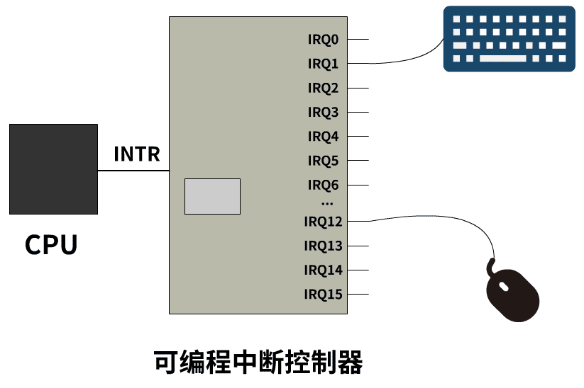

# Basic

```assembly
label   mnemonic   operands   # comment
# 标签
labelName: .quad 0x123432
# 早期通过缩紧来确定文本是属于 标签、助记符、操作数... 还是注释；现在最好保留
# intel语法 和 GAS语法
# GAS语法又称为 AT&T语法;  「指令+源+目的」
# intel语法; 「指令+目的+源」
# 编译器： GCC(gcc+gdb)和LLVM(clang+lldb)
# MacOS编译器：as - "Mac OS X Mach-O GNU-based assemblers"
```

# 约定
- 32bytes shadow space before each call
```assembly
; 实际使用
sub		resp, 28h;
; 实际申请 40 bytes, 原因在于需要做栈的16位对齐, 而在每次调用时都先保存了 8 bytes 的return caller address
; 故总的为48bytes, aligned on 16 bytes
```

## 种类

- x86汇编语言：这是应用最广泛的汇编语言之一，用于PC和服务器上的基于Intel或AMD处理器的操作系统和应用程序
- ARM汇编语言：这是应用最广泛的嵌入式处理器架构之一，通常用于移动设备、智能家居、汽车电子等领域
- MIPS汇编语言：这是另一种流行的嵌入式处理器架构，通常用于路由器、交换机和其他网络设备
- PowerPC汇编语言：这是IBM的处理器架构所使用的汇编语言，通常用于高性能计算和服务器领域

## 文件系统类型 nasm -fxxx
### elf64 - linux
### macho64 - MacOS
```massembly
; 1. file  type: macho64; nasm -fmacho64
; 2. system call numbers different
; 3. doesn’t allow absolute addressing, unless tweaking
		default rel

	lea		rdi, [msg]
; 4. 16-bit stack alignment is enforced
```
### windows
[Overview of x64 ABI conventions](https://learn.microsoft.com/en-us/cpp/build/x64-software-conventions?redirectedfrom=MSDN&view=msvc-170)

## 编译器

- NASM（Netwide Assembler）：NASM是一种广泛使用的x86汇编编译器，可在多个平台上使用，并支持多种输出格式。它具有强大的宏功能和符号处理能力，因此被广泛应用于操作系统和低级软件的开发，并且在Linux内核等开源项目中得到了广泛应用
- MASM（Microsoft Macro Assembler）：MASM是由微软公司开发的一种x86汇编编译器。它是Windows平台上最常用的汇编编译器之一。MASM提供了很多高级功能，例如结构、宏定义和地址计算等，并且同时支持32位和64位的开发。通常用于Windows驱动程序、程序库和DLL等的编写
- FASM（Flat Assembler）：FASM是一种快速、小巧而功能强大的汇编编译器，它支持多种操作系统和CPU体系结构，包括x86和ARM等。它是一个自包含的程序，可以生成可执行文件或二进制文件，不需要任何外部依赖关系。由于其高效性和可移植性，FASM被广泛应用于操作系统、嵌入式设备和游戏引擎等领域

__rflags__


```assembly
# 每一个以F结尾的位都代表一个flag
# 指令会影响指标位
# IF 标识位，interrupt flag
```


- 内存寻址

```assembly
# $偏移量(%基址, %指标, %倍数)
# 代表地址为 基址+指标*倍数+偏移量 处的内存单元中存储的值
# % -> 寄存器，即基址和指标都是寄存器
# $ -> 数字，即偏移量和倍数都是数字
# 基址 + 偏移量 -> 寄存器+数字 栈
# 基址 + 指标 -> 寄存器 + 寄存器
# 倍数 -> 存不同位长的数
```

- 结构-内存段

```assembly
.segment seg  # 段
.section seg, sec  # 节
# 段：
# __TEXT: 存储代码
.section  __TEXT, __text  # __TEXT段的__text节, 等价于 .text
# __DATA: 存储数据
	# __data
	.section __DATA, __data # 等价于 .data 存放所有非const的已经被初始化过的变量
	# __bss
	.section __DATA, __bss  # 等价于 .bss  存放所有未被初始化的static的变量
	# __common
	.section __DATA, __common  # 等价于 .common 存放所有未被初始化过的外部全局变量
# 存数据的时候需要指定数据长度
.byte  0x112358  # 1字节
.short					 # 2字节
.long						 # 4字节
.quad						 # 8字节
# eg
    .data
a:  .quad	0x114514, 0x12423  # a

```

- 汇编器指令

> 如何做、如何汇编；不会翻译成机器码

```assembly
	.section segname, sectname  # 段和节
	.globl _main  # 声明全局可见的标签，将_main标签的代码暴露作为调用入口
	.equ varName, value. # #define 定义字面量

_main:
	# 代码块
```

# 寄存器


>大端: 低地址到高地址存储高位字节到低位字节
>小端：低地址到高地址存储低字节到高位字节
```assembly
	.section __TEXT, __text
	.equ value, 0x1234abcd
	.globl _main
# 字节为单位
_main:
	mov value, %rsp
	# 大端：0x1234abcd
	# 小端：0xcdab3412

# x86-64架构下有16个64位通用寄存器； ARM处理器 r1->r15
# rax、rbx、rcx、rdx
# rdi、rsi
# rbp、rsp
# eax, ebx, ecx, edx, edi, esi, ebp, esp 指代上述的低32位
# r8、r9、r10、r11、r12、r13、r14、r15
```

```assembly
ip # instruction pointer  rip中的值就是下一条汇编指令在内存中，也就是逻辑地址空间中的值(PC-relative寻址)
flags  # 状态标志寄存器，二进制位标识作用


sp  # stack pointer 栈顶指针
bp  # base pointer
si  # source 源变址
di  # destination 目的变址


cs  # code segment 代码段寄存器, CPU正在执行的代码在内存中位置, cs:eip 配合指向, cs是基址, ip是偏移地址
ds  # data segment 数据段寄存器, 在内存寻址时充当段基址的作用 ds:xxx
ss  # stack segment 堆栈段, 配合栈基址寄存器 sp 来表示此时的栈顶地址；ss:esp
es  # extend segment 扩展附加段,


ax
bx
cx
dx


idtr  # interrupt desc table 中断描述符表索引，存 表起始地址 和 表大小
gdtr  # global desc 全局描述符表索引


# 控制寄存器
cr0   #
cr1
cr2
cr3   # 页表索引，指向页目录表
cr4

# 浮点数寄存器 sd suffix; addsq/cvtsi2sd  intToDouble
xmm0
xmm1

movaps
movdqa

```

# 内存分段

## .bss
> Block Started by Symbol 段是用于存放未初始化全局变量或静态变量的一段内存空间; 这个段中的变量在程序开始执行前会被自动初始化为0或Null


## .data
> 用于存放已初始化全局变量或静态变量的一段内存空间; 程序开始执行前就已经被初始化了

## .text
> 用于存放程序指令的一段内存空间; 程序开始执行时被载入到指令寄存器中，然后被CPU逐条解释执行

# 指令

```assembly
# 字长单位候选集：
# b 字节byte
# w 字word
# l 四字节
# q 八字节
```
## 数据保存
```assembly
	; define byte/word/doubleword/quadword
	; db bytes
	; dw word = 2 bytes
	; dd double word = 4 bytes
	; dq quad word = 8 bytes
var:  db    0x55                ; just the byte 0x55
      db    0x55,0x56,0x57      ; three bytes in succession
      db    'a',0x55            ; character constants are OK
      db    'hello',13,10,'$'   ; so are string constants
      dw    0x1234              ; 0x34 0x12
      dw    'a'                 ; 0x61 0x00 (it's just a number)
      dw    'ab'                ; 0x61 0x62 (character constant)
      dw    'abc'               ; 0x61 0x62 0x63 0x00 (string)
      dd    0x12345678          ; 0x78 0x56 0x34 0x12
      dd    1.234567e20         ; floating-point constant
      dq    0x123456789abcdef0  ; eight byte constant
      dq    1.234567e20         ; double-precision float
      dt    1.234567e20         ; extended-precision float

; 声明变量 不初始化 reserve byte/word/quadword
buffer:         resb    64              ; reserve 64 bytes
wordvar:        resw    1               ; reserve a word
realarray:      resq    10              ; array of ten reals
PI				equ		3.1415926		; PI = 3.1415926
```


## 数据传送

```assembly
mov  # move；将对应地址的值赋值给目标操作数
lea  # load effective address；将对应的地址赋值给目标操作数
push/pop
XCHG   # eXCHanG 交换指令，两操作数值交换
XLAT   # TRANSLATE 换码指令，一种代码转换为另一种代码 ？
PUSHF/POPF  # 标志进/出栈指令
```

## 算术

```assembly
ADD
ADC  # 带进位加法指令，dst = src + dst + CF
SUB
SBB  # 带借位减法指令
INC/DEC
NEG  # 求补
CAMP # 比较，隐式减

; 浮点数计算：标量计算、打包计算·
addpd	; packed two double
addsd	; one single double
addps	; packed two single precision double
addss	; one single precision double

; 正数使用xmm计算： Saturated Arithmetic 饱和运算，限制在一定范围，而不是溢出
; padd...
paddb		; 16 bytes
paddw		; 8字 = 16 bytes
paddd		; 4 个双字 = 128bytes
paddq		; 2 个四字 = 128bytes
paddsb		;
paddsw		;
paddusb		;
paddusw		;


```

## 逻辑

```assembly
AND
OR
NOT
XOR
TEST  # 两个操作数相与的结果不保存，检测某位是否为1

```

## 串处理

```assembly
MOVS  # 串传送指令
STOS  # 存入串指令
LODS  # 从串取指令
CMPS  # 串比较指令
SCAS  # 串扫描指令
```

## 控制转移

```assembly
# 转移
jmp # 无条件转移
JZ  # jump if zero
JE  # jump if eqaul; 等价于 JZ
JNZ/JNE  # not zero/equal
JS  # jump is sign，结果为负则转移
JNS # jump if not sign
JO  # jump if overflow
JNO
JL  # jump if less
LNGE # 等价于JL 不是大于或等于
JNL # 不小于则转移
JGE # 等价于JNL 大于或小于
JLE/JNG # 小于或等于、不大于
JNLE/JG # 不小于或等于、大于
# 循环
LOOPZ/LOOPE # 当为零或相等时循环指令
LOOPNZ/LOOPNE # 当不为零或不相等时循环指令
CALL # 调用指令
RET  # 返回指令
```

## 硬件

```assembly
INT 0x80  # 发送中断号
idt_descr:
		.word 246 * 8 - 1
		.long idt_table
LIDT idt_descr
IN al, 0x64 # 读端口
OUT  # 写端口
```

## 跳转和函数

> 冒号结尾的标识符，不能以数字开头；可以在 .data 和 .text 段定义标签

### 跳转

#### 无条件跳转
```assembly
; goto
_main:
loop_begin: movq $0x112358, %rax
            mp loop_begin
```

#### 条件跳转 - 控制转移
> action + flags
##### action
- j	conditional jump
- set conditional set
- cmov conditional move
##### flags
- z sign
- z zero
- c carry
- o overflow

```assembly
jz	L	;Jump to label if the result of the operation was zero
cmovno	x, y	;if the last operation did not overflow do x <- y
setc	x	;x <- 1 if the last operation had a carry, but x <- 0 otherwise ( x
 must be a byte-size register or memory location)
```
### 函数

```assembly
call label # 类似jmp，但还会把当前的rip寄存器push到栈区里
ret  # 无操作数，默认回到当前栈顶即rsp指向的位置，并弹出栈顶地址
# callq和retq 只是强调那个地址是8字节
```

#### 调用约定(Calling Convention)

- 参数传递

```assembly
# AMD64 ABI
# 默认传递的是Interger类，除需特殊处理的double， 如：int、long、short、char
# 参数传递从左 --> 右的寄存器
# rdi、rsi、rdx、rcx、r8、r9
# 多于6个参数：将多的部分按右至左即逆序压入栈内
# _main 函数 默认的两个参数： argc、 argv --> %rdi、 %rsi
```

- 返回值

```assembly
# return 0;
movq $0, %rax
retq
```

- 保留寄存器

```assembly
# Calling函数：rbp, rbx, r12, r13, r14, r15； 只能保证这几个寄存器的值不会变化
# Called函数：其他；需要保留上述寄存器的值不变 - 使用栈
# pushq %rbp -> popq %rbp
```

#### 函数调用

- 调用本文件的函数

```assembly
call __fib
```

- 调用其他汇编文件的函数

```assembly
# my.s -> __main
	.globl _add
_add:
	# do add
# other.s -> _add
# 不能同时有_main
	.globl _main, _add
_main:
	call _add
```

```sh
# 编译 链接
as my.s -o my.o
as other.s -o other.o
ld my.o other.o -o my -lSystem
```

- 调用C语言函数

```assembly
# 按照c语言转汇编的名字转换规则进行调用
# C: int add(int a. int b) -->  Assembly: _add:
# 直接使用 .globl _add
# 链接 目标文件 并 生产可执行文件
```

- 调用库函数

```assembly
# 操作系统的提供
# MacOS 库函数： /usr/lib/libSystem.dylib/； -lSystem 就代表链接libSystem.dylib
# libc C标准库
# libinfo NetInfo库
# libkvm 内核虚存库
# libm 数学库
# libpthread POSIX线程库
# C 头文件：/Library/Developer/CommandLineTools/SDKs/MacOSX.sdk/usr/include/
```

- 被C语言调用

```assembly
# *.s
_func:
	# do something
# *.c
extern void func();
extern int func(int a, int b);
```

### 系统调用

> System Call 操作系统提供的接口； 内核态和用户态

汇编代码都是在用户态执行的，但文件读写、进程创建等都需要在内核态实现，需要调用系统接口。

```assembly
# 用户态 --> 系统库 <--封装-- 系统调用
# 系统调用实质上是操作系统提供给我们的一个C函数接口，一个系统调用对应一个函数原型
# /Library/Developer/CommandLineTools/SDKs/MacOSX.sdk/usr/include/sys/syscall.h
# 			系统调用名					 系统调用号
#define	SYS_syscall        0
#define	SYS_exit           1
#define	SYS_fork           2
#define	SYS_read           3
#define	SYS_write          4
#define	SYS_open           5
#define	SYS_close          6
#define	SYS_wait4          7
```

```assembly
# 调用方式
# 1. 系统调用号 赋值 给 %rax 寄存器
# 2. 传参：%rdi、%rsi ... 同函数
# 3. syscall
# macOS 的内核 XN U是分为 BSD 层和 Mach 层, 常用的系统调用都属于BSD的系统调用, 而BSD层在逻辑地址上是位于Mach层之上, 所以 BSD 层要从 0x2000000 开始，实际使用 syscall.h 时需要加上 BSD 起始地址做偏移。
movq $0x2000001, %rax
movq $0, %rdi
syscall
```

```assembly
# crt1.o
int rVal = main(argc, argv);
exit(rVal);

# 1.  C: exit(0)
	.text
	.globl	_main
_main:
	# do something
	movq	$0x2000001, %rax
	movq	$0, %rdi
	syscall
# 2. C: return(0) + crt1.0
	.text
	.globl	_main
_main:
	# do something
	retq
```

# 操作数
> 三类：Register Operands、Memory Operands、Immediate Operands

TODO
## Register Operands 整数寄存器/通用寄存器
> EAX, EBX, ECX, EDX, ESP 等, 常用于执行高效的算术和逻辑操作、存储内存地址、函数参数、临时变量
> E 表示低32位


## Memory Operands 内存操作数

### 格式
```assembly
[ number ] 											  直接寻址  MOV EAX, [0x12345678]
[ reg ]												  寄存器存储的值作为地址
[ reg + reg*scale ]      scale is 1, 2, 4, or 8 only  变址索引  MOV EAX, [EBX+ECX*4]
[ reg + number ]									  基址索引  MOV EAX, [EBX+8]
[ reg + reg*scale + number ]
```

## Immediate Operands 立即操作数
> 直接包含在指令中的值或数据，而不是存储在寄存器或内存位置中的数据
```assembly
MOV AX, 5
ADD BX, 10
;;;;;;;;;;;;;
; 十进制：纯数字、0前缀、0d前缀、d后缀
; 十六进制：0h前缀、h后缀 + 0前缀、0x前缀
; 八进制：0q前缀、q后缀
; 二进制：0b前缀、b后缀
200          ; decimal
0200         ; still decimal - the leading 0 does not make it octal
0200d        ; explicitly decimal - d suffix
0d200        ; also decimal - 0d prefex

0c8h         ; hex - h suffix, but leading 0 is required. 不然像字符串
0xc8         ; hex - the classic 0x prefix
0hc8         ; hex - for some reason NASM likes 0h

310q         ; octal - q suffix
0q310        ; octal - 0q prefix

11001000b    ; binary - b suffix
0b1100_1000  ; binary - 0b prefix, and by the way, underscores are allowed
```

# 中断

> **操作系统就是中断驱动的死循环**
> **其他所有事情都是由操作系统提前注册的中断机制和其对应的中断处理函数完成**
> **中断 = 中断 + 异常，异常 = 故障、陷阱、中止**
> **硬中断包括中断、异常以及 INT 指令这种软件中断**

## 硬中断

> 硬件**实现**的中断
> CPU 在每一个指令周期的最后，都会留一个 CPU 周期去查看是否有中断，如果有，就把中断号取出，去中断向量表中寻找中断处理程序，然后跳过去

```assembly
# An interrupt is an asynchronous event that is typically triggered by an I/O device.
# An exception is a synchronous event that is generated when the processor detects one or more predefined conditions while executing an instruction. faults, traps and aborts

# 1. 触发中断 = 传递中断号给CPU
# 1.1 可编程中断控制器的INTR引脚
# 1.2 exceprion cpu产生中断号
# 1.3 INT指令
INT 0x80

# 2. CPU收到中断号n
# 2.1 中断描述符表索引 idtr 中寻找对应中断号n对应描述符中的：段选择子、段内偏移地址
# 2.2 全局描述符表索引 gdtr 中根据 段选择子 寻找段描述符中的：段基址
# 2.3 段基址 + 段内偏移地址 获得 中断处理程序代码入口

# 3. 执行
# 3.1 上下文处理，压栈操作（特权级切换程序堆栈 ss:esp、eflags、当前cs:eip、error_code）
# 3.2 程序代码入口地址放入 cs:ip
# 3.3 执行
# 3.4 IRETD  弹出栈顶三个元素，并赋值给 eip、cs、eflags

# 中断描述符：段选择子 + 段内偏移地址
# 1. Task Gate 任务门描述符
# 2. Interrupt Gate 中断门描述符 （不允许嵌套，IF标志位）
# 3. Trap Gate 陷阱门描述符 （允许嵌套）
```

硬件中断号传递： 可编程中断控制器 + IRQ引脚线 + 中断号 --> CPU



## 软中断

> **纯软件**实现的中断
> **单独的守护进程**，不断轮询一组**标志位**，如果哪个标志位有值了，那去这个标志位对应的**软中断向量表数组**的相应位置，找到软中断处理函数，然后跳过去

```assembly
# spawn_ksoftirqd()  spawn kernel soft irt daemon
# 内核软中断守护进程
```

# 实模式和保护模式

```assembly
# 实模式下，一个段地址的值是物理内存里的一节的首地址。段基址
# 保护模式下，一个段地址的值是一个指向描述符表的指针。段选择子
# 两种模式下，程序都是被分成段。在实模式下，这些段在物理内存的固定位置而且段地址的值表示段开始处所在节的首地址。在保护模式下，这些段不是在物理内存的固定的地址。甚至不一定需要在物理内存中（虚拟内存的技术）

# 段寄存器（比如 ds、ss、cs）里存储的是段选择子，段选择子去全局描述符表中寻找段描述符，从中取出段基址
lgdt gdt_48
jmpi	0,8	 # 跳转到段地址为8，偏移地址为0
# 8 -> 0x 0000,0000,1000
# 段选择子： 15 - 3 : 2 - 0
#        描述符索引，用于去gdt寻找段描述符
# 故此时去找 gdt 的第一段。 （0开始）

# 虚拟内存：基本思想是仅仅保存程序现在正在使用的代码和数据到内存中
```


# 调试

```shell
# 增加 -g 调试选项 将 调试信息保存至 main.o
as main.s -g -o main.o
# 链接
ld main.o -i main -lSystem
# 调试
lldb main
# 调试命令
1. run arg1 arg2 ...
2. quit
3. breakpoint set --file main.s --line 6
4. continue
5. nexti  # 步进调试
6. register read [cache_name|-all] # 无选项时读取常用寄存器的值，[指定寄存器｜全部]
7. memory read [address]  # 读取指定内存地址中的值
```

# C Aspect

```shell
# 高级语言：预处理 -> 编译 -> 汇编 -> 链接 -> 可执行文件
# main.c

# 1. 预编译/预处理
clang -E main.c -o main.i
# 2. 编译 -> 汇编文件
clang -S main.c -o mian.s
clang -S main.i -o mian.s
# 3. 汇编 -> 目标文件;  汇编代码 --> 机器码， 除去标签、符号； nm -n -m main.o 查看符号表
as main.s -o main.o
# 4. 链接 -> 可执行文件； 符号定位的功能，确定undefine的外部符号
ld -e _main main.o -o main -lSystem  # 默认入口 _main
clang main.s -o main
# 5. 可执行文件的执行阶段的动态链接
# 库函数都放在 *.dylib; -lSystem选项实质上就是链接了动态链接库libSystem.dylib
# 链接器如果遇到动态链接库，那么只会给符号重定位，而不会将代码整合到可执行文件中；执行时动态链接器 dyld 将链接的动态库装载进逻辑地址空间（做映射），解决多个拷贝和动态升级
otool -L test # 查看可执行文件链接的动态链接库
# 查看汇编指令
otool -v -t main
# 查看DATA段
otool -v -s __DATA __data main
```


